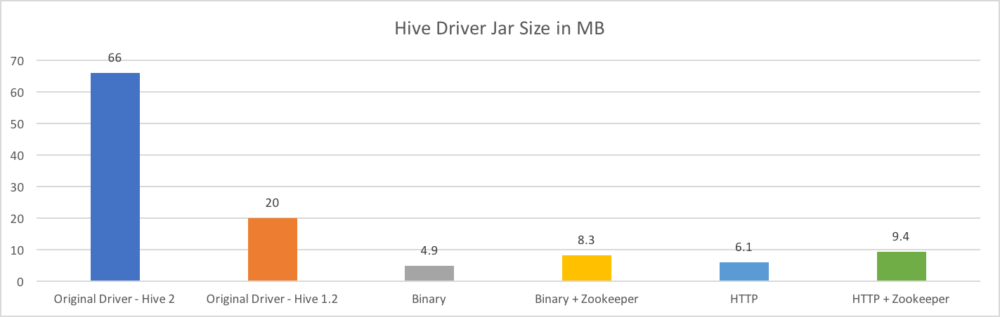

# Hive JDBC Driver

This project is alternative to the JDBC driver that is bundled with the Apache Hive project.  The desire to build this grew out of my experience maintaining the Hive JDBC "uber jar" project ([here](https://github.com/timveil/hive-jdbc-uber-jar)) which attempted to produce a smaller, more complete standalone driver jar by crafting an alternative Maven `pom` file.  While that effort mostly succeed in creating a slightly smaller jar, I felt like more could be done to improve the Hive JDBC experience.

As I started building out this project I realized that I wanted to deviate significantly from the existing Apache implementation.  As a result, this project does not desire or attempt to be URL or even feature compatible with the existing Apache Driver.  One obvious manifestation of this is that existing JDBC connection strings/URLs that work with the Apache Driver __WILL NOT WORK__ with this driver without modification.  I've provided a mapping for existing URL properties [here](DRIVER-PROPERTIES.md) as well as plenty of [examples](EXAMPLES.md). Another significant deviation is packaging.  In an effort to significantly trim jar sizes, I publish different flavors of the jar depending on connection type.  There is no one size fits all jar, instead the following flavors are produced:

- Binary: for `binary` connections without zookeeper discovery support
- Binary + Zookeeper: for `binary` connections that leverage zookeeper discovery
- HTTP: for `http` connections without zookeeper discovery support
- HTTP + Zookeeper: for `http` connections that leverage zookeeper discovery

The third significant deviation is the absence of Hadoop or Hive dependencies and their transitive dependency graphs.  The only bridge to Hive in this driver is the Thrift Interface Description Language (IDL) file.  All necessary code was rewritten from the ground up with an emphasis on eliminating external dependencies.  This, in combination with packaging, has the clear benefit of significantly reducing jar sizes.  For example if you are connecting to Hive running LLAP (Hive 2.x) using `binary` transport (the default) and not using Zookeeper discovery, the jar is 92% smaller than the original!

disclaimer
why/rationale
how to build
how to use

todo: need a full comparison of size and dependency graph for both hive 1.x and 2.x; a chart would be cool here

## Rationale

### Current Problems

* Bundled Driver Dependency Graph
  * Poorly managed transitive dependencies
    * Unnecessary and unused jars abound (this is a problem with hadoop projects in general, not just hive)
    * outdated or duplicate transitive dependencies can/do cause major challenges when embedding driver into applications or tools
  * Size in MB
    * hive-jdbc-2.1.0.2.6.1.0-129-standalone.jar (the latest Hive 2.0) is over 66mb
    * hive-jdbc-1.2.1000.2.6.1.0-129-standalone.jar (the latest 1.2.x) is almost 20mb
  * contains server side dependencies
* Unnecessary complexity
  * don't need embedded logic
  * don't need server side code
  * relies on UGI - see book (https://www.gitbook.com/book/steveloughran/kerberos_and_hadoop/details)
* Poorly documented
* Kerberos options are limited, require many outside the driver configs
* URL options are inconsistent in name and style
* URL parsing made overly complex by different delimeters and overloaded meanings for some properties or combinations of properties
* Logging is sparse and improperly configured
* difficult to embed in applications and 3rd party tools like DbViz, etc.

### Benefits
* Extremely limited dependency graph thus trimming the jar size and reducing classpath risks/issues
    * driver-binary-1.0-SNAPSHOT.jar is 4.9mb
    * driver-binary-zookeeper-1.0-SNAPSHOT.jar is 8.3mb
    * driver-http-1.0-SNAPSHOT.jar is 6.1mb
    * driver-http-zookeeper-1.0-SNAPSHOT.jar is 9.4mb
* Only dependency on Hive project is the *.thrift file that it defines.  all thrift client code is compiled directly in this project.
* No UGI; reimplementaiton of all kerberos/jaas related code
* Simplified implementation
* Better documentation
* Simpler and more complete URL config options
* Improved logging
* More options for kerberos
* separate driver's for binary, binary-zookeeper, http, http-zookeeper
* much easier to embed in applications or 3rd party tools (single, small driver jar. no external configuration)
